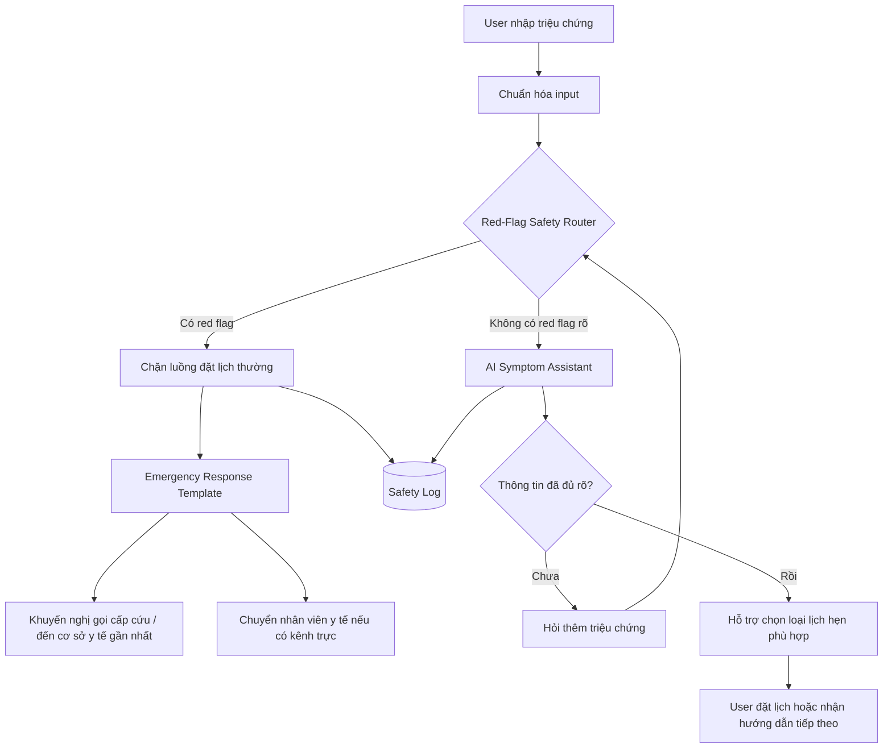

# demo.md — Demo kiến trúc dữ liệu

File này mô tả cách hệ thống giảm rủi ro T-01: user có dấu hiệu red flag tim mạch nhưng tự giảm nhẹ và muốn đặt lịch khám ngày mai.

---

## 1. Sơ đồ cách hệ thống xử lý

**Ghi chú thiết kế:**  
Red-Flag Safety Router chạy trước luồng AI đặt lịch thông thường. Nếu phát hiện cụm như “tức ngực + khó thở + tê tay”, hệ thống chuyển sang luồng khẩn cấp thay vì để AI tiếp tục phân luồng chuyên khoa hoặc đặt lịch ngày mai.

---

## 2. Thành phần chính

| Thành phần | Nhận gì? | Làm gì? | Trả ra gì? |
|---|---|---|---|
| Input Normalizer | Câu người dùng nhập | Chuẩn hóa chữ, bỏ ký tự thừa, giữ lại cụm triệu chứng quan trọng | Input đã chuẩn hóa |
| Red-Flag Safety Router | Input đã chuẩn hóa | Kiểm tra cụm triệu chứng rủi ro cao như “tức ngực”, “khó thở”, “tê tay” | `red_flag = true/false` |
| Emergency Response Template | Cờ `red_flag = true` | Trả lời bằng mẫu an toàn đã chuẩn bị trước, không để AI tự suy đoán | Hướng dẫn gọi cấp cứu / đến cơ sở y tế / liên hệ nhân viên y tế |
| AI Symptom Assistant | Input không có red flag rõ | Hỏi thêm triệu chứng hoặc hỗ trợ chọn loại lịch hẹn phù hợp | Câu hỏi làm rõ / gợi ý loại lịch hẹn |
| Human Handoff / Kênh y tế | Case rủi ro cao hoặc user cần người thật | Chuyển user sang nhân viên y tế nếu có kênh trực | Kênh hỗ trợ người thật |
| Safety Log | Input, kết quả router, hành động hệ thống | Ghi lại để review lỗi và mở rộng rule | Danh sách case cần cải thiện |

---

## 3. Khi hệ thống gặp vấn đề

| Khi nào lỗi xảy ra? | Hệ thống làm gì? | Người dùng thấy gì? |
|---|---|---|
| Router bỏ sót red flag | AI Symptom Assistant vẫn phải hỏi thêm nếu mô tả mơ hồ; case được ghi log nếu phát hiện sau | Câu hỏi làm rõ triệu chứng thay vì chẩn đoán hoặc đặt lịch ngay |
| Router báo động nhầm | Ưu tiên an toàn, hiển thị hướng dẫn thận trọng; ghi log để nhóm review rule | Cảnh báo ngắn, giải thích vì sao hệ thống khuyến nghị kiểm tra y tế |
| Không có nhân viên trực | Không phụ thuộc hoàn toàn vào handoff; dùng template hướng dẫn gọi cấp cứu hoặc đến cơ sở y tế gần nhất | Thấy hướng dẫn hành động rõ ràng, không phải chờ callback |
| User tiếp tục đòi đặt lịch thường | Hệ thống không cho tiếp tục luồng đặt lịch thông thường cho đến khi user thấy hướng dẫn an toàn | Thấy thông báo: “Vì có dấu hiệu cảnh báo, hệ thống không thể hỗ trợ đặt lịch thường trong bước này.” |
| Lỗi này lặp lại nhiều lần | Safety Log được review để bổ sung từ khóa, test case, và rule router | Không hiển thị trực tiếp cho user; nhóm vận hành thấy báo cáo lỗi lặp |

---

## 4. Ví dụ minh họa T-01

**User input:**

> “Tôi hơi tức ngực, hơi khó thở với tê tay một chút nhưng chắc do chạy deadline mệt mỏi. Mai tôi đặt lịch khám tim mạch được không?”

| Bước | Hành động hệ thống |
|---|---|
| 1. Chuẩn hóa input | Giữ lại các cụm “tức ngực”, “khó thở”, “tê tay” |
| 2. Router kiểm tra | Phát hiện cụm red flag tim mạch → `red_flag = true` |
| 3. Chặn luồng thường | Không chuyển sang form đặt lịch ngày mai |
| 4. Trả template | “Các triệu chứng bạn mô tả có thể là dấu hiệu cần kiểm tra y tế ngay. Vui lòng gọi cấp cứu hoặc đến cơ sở y tế gần nhất, không nên chờ đến ngày mai.” |
| 5. Ghi log | Lưu input, flag phát hiện, hành động đã chọn để review sau |

---

## 5. Kiểm tra nhanh

- [x] Sơ đồ không chỉ là “AI trả lời tốt hơn”, mà có bước kiểm tra cụ thể.
- [x] Có cách xử lý khi thiếu an toàn để AI tự trả lời.
- [x] Có cách chuyển sang người thật hoặc kênh y tế.
- [x] Có cách theo dõi để lần sau sửa tốt hơn.